# 3D Mesh Renderer

This project is designed to render 3D meshes from various angles, which is particularly useful for creating datasets for 3D deep learning tasks.

## Table of Contents

- [Installation](#installation)
- [Data and Configuration Preparation](#data-and-configuration-preparation)
- [Usage](#usage)

## Installation

1. **Install Pytorch3D**: Before proceeding, ensure you have Pytorch3D installed. It's recommended to follow the [official instructions](https://github.com/facebookresearch/pytorch3d/blob/main/INSTALL.md).

2. **Install the Project**:
   ```bash
   pip install -e .
   ```

## Data and Configuration Preparation

1. **Generate Configuration Files**: For each 3D model you wish to render, generate a YAML configuration file and store them in a specific folder. An example of how to generate these configurations is provided in `config_generation_example.py`.

   The configuration supports the following parameters:

   - `image_size`: Size of the output renders in pixels.
   - `num_samples`: Number of output rendered images.
   - `randomize`: Parameter for randomizing angles of view. Important for some sampling methods.
   - `obj_filename`: Path to the `.obj` file to render.
   - `sampling_method`: Method name to sample points of view for rendering.
   - `seed`: Fixes the distribution of angles if randomizing is applied.
   - `save_dir`: Directory to save output renders and other files.
   - `save_gif`: Boolean parameter to save a GIF consisting of output renders.
   - `save_vis`: Boolean parameter to save an HTML file visualizing the distribution of camera angles on a sphere.

   Here's a configuration example:

   ```yaml
   image_size: 1024
   num_samples: 20
   randomize: true
   obj_filename: data/cow/cow.obj
   sampling_method: fibonacci_sphere
   seed: 42
   save_dir: data/cow
   save_gif: false
   save_vis: false
   ```

2. **Create a Rendering Configuration**: This configuration dictates the rendering process. It requires the following parameters:

    - `params_dir_path`: Path to the directory containing the above-described configurations.
    - `num_gpus`: Number of GPUs to utilize for rendering. A value of -1 means to use all available GPUs.

    Here's an example:

    ```yaml
    params_dir_path: params
    gpus_num: -1
    ```

Examples of renders of aircraft are provided below:

|         |         |         |         |         |         |
|---------|---------|---------|---------|---------|---------|
|  | 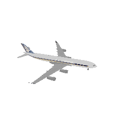 | 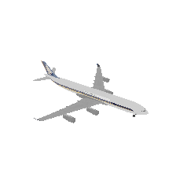 | 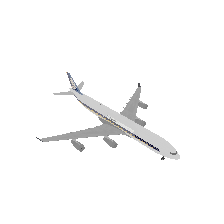 | 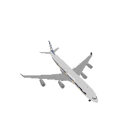 | 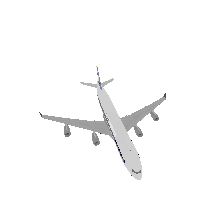 |
|  | 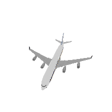 | 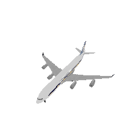 | 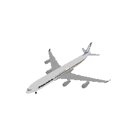 | 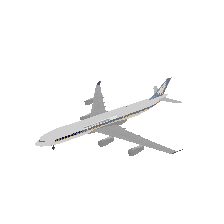 | 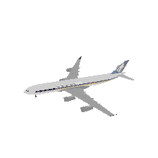 |
|  | 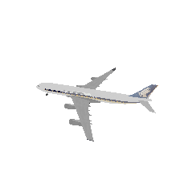 | 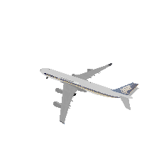 | 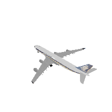 | 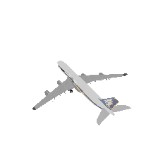 | 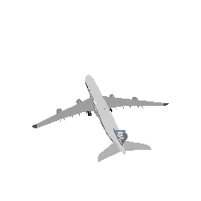 |
| 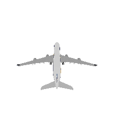 | 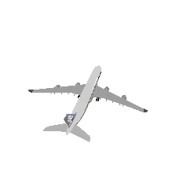 | 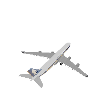 | 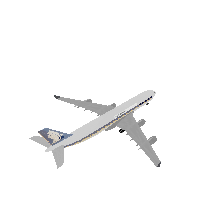 | 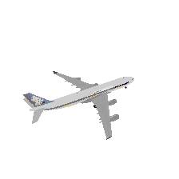 | 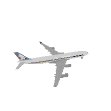 |

## Usage

Once you've prepared all the necessary configurations, you can initiate the rendering process with the following command:

```bash
render --config [your_render_config.yaml]
```